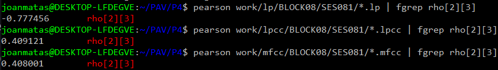

PAV - P4: reconocimiento y verificación del locutor
===================================================

Obtenga su copia del repositorio de la práctica accediendo a [Práctica 4](https://github.com/albino-pav/P4)
y pulsando sobre el botón `Fork` situado en la esquina superior derecha. A continuación, siga las
instrucciones de la [Práctica 2](https://github.com/albino-pav/P2) para crear una rama con el apellido de
los integrantes del grupo de prácticas, dar de alta al resto de integrantes como colaboradores del proyecto
y crear la copias locales del repositorio.

También debe descomprimir, en el directorio `PAV/P4`, el fichero [db_8mu.tgz](https://atenea.upc.edu/mod/resource/view.php?id=3508877?forcedownload=1)
con la base de datos oral que se utilizará en la parte experimental de la práctica.

Como entrega deberá realizar un *pull request* con el contenido de su copia del repositorio. Recuerde
que los ficheros entregados deberán estar en condiciones de ser ejecutados con sólo ejecutar:

~~~~~~~~~~~~~~~~~~~~~~~~~~~~~~~~~~~~~~~~~~~~~~~~~~~~~.sh
  make release
  run_spkid mfcc train test classerr verify verifyerr
~~~~~~~~~~~~~~~~~~~~~~~~~~~~~~~~~~~~~~~~~~~~~~~~~~~~~

Recuerde que, además de los trabajos indicados en esta parte básica, también deberá realizar un proyecto
de ampliación, del cual deberá subir una memoria explicativa a Atenea y los ficheros correspondientes al
repositorio de la práctica.

A modo de memoria de la parte básica, complete, en este mismo documento y usando el formato *markdown*, los
ejercicios indicados.

## Ejercicios.

### SPTK, Sox y los scripts de extracción de características.

- Analice el script `wav2lp.sh` y explique la misión de los distintos comandos involucrados en el *pipeline*
  principal (`sox`, `$X2X`, `$FRAME`, `$WINDOW` y `$LPC`). Explique el significado de cada una de las 
  opciones empleadas y de sus valores.
  ```bash
  sox $inputfile -t raw -e signed -b 16 - | $X2X +sf | $FRAME -l 240 -p 80 | $WINDOW -l 240 -L 240 |
	  $LPC -l 240 -m $lpc_order > $base.lp
  ```
  - sox: es un programa que permite realizar distintas tareas con ficheros de audio. En este caso convertimos el fichero inputfile de .wav a .raw (sin cabecera) con -t raw. -e signed significa que usamos una codificación con signo y -b 16 que cuantificamos cada muestra con 16 bits.

  - sptk x2x: es un comando de sptk que sirve para la conversión entre distintos formatos de datos. Con +sf estamos convirtiendo los datos de signed short a float.

  - sptk frame: dividimos la señal de entrada en tramas de l muestras con un desplazamiento de p muestras. En este caso escogemos l = 240 muestras y p = 80 muestras.

  - sptk window: multiplicamos cada trama por una ventana. Con -l y -L escogemos el tamaño de frame de la entrada y de la salida respectivamente (en este caso 240 muestras ambos). Al no especificar un tipo de ventana, sptk usa por defecto la Blackman.

  - sptk lpc: por último, con esta opción extraemos los coeficientes LPC. Indicamos el tamaño de entrada (l = 240 muestras) y el orden del LPC (-m), que en este caso lo escogeremos desde run_spkid.sh. Los coeficientes se almacenan en el fichero temporal base.lp.

- Explique el procedimiento seguido para obtener un fichero de formato *fmatrix* a partir de los ficheros de
  salida de SPTK (líneas 45 a 47 del script `wav2lp.sh`).

  ```bash
  # Our array files need a header with the number of cols and rows:
  ncol=$((lpc_order+1)) # lpc p =>  (gain a1 a2 ... ap) 
  nrow=$($X2X +fa < $base.lp | wc -l | perl -ne 'print $_/'$ncol', "\n";')

  # Build fmatrix file by placing nrow and ncol in front, and the data after them
  echo $nrow $ncol | $X2X +aI > $outputfile
  cat $base.lp >> $outputfile
  ```

  Nuestro fichero *fmatrix* necesita una cabecera con el número de filas y de columnas. El número de columnas lo obtenemos fácilmente, ya que coincidirá con el orden del LPC + 1, teniendo en cuenta que se añade una posición para la ganancia.
  Para encontrar el número de filas llevamos a cabo el siguiente proceso:
  - Con *sptk x2x +fa* pasamos los *floats* del fichero *base.lp* a ASCII, de forma que tenemos un número en cada línea. 
  - El comando *wc -l* nos devuelve el número de líneas que se le pasen y, por lo tanto, el número de valores que tenemos. 
  - Por último con *perl -ne 'print $_/'$ncol', "\n";'* dividimos el número de valores por el número de columnas, obteniendo así el número de filas.

  Ahora pasamos nrow y ncol a unsigned con *sptk x2x +aI* y los añadimos al comienzo del fichero de salida. Finalmente con *>>* añadimos los coeficientes que habíamos guardado en 
  *base.lp* al mismo fichero de salida.

  * ¿Por qué es conveniente usar este formato (u otro parecido)? Tenga en cuenta cuál es el formato de
    entrada y cuál es el de resultado.

    La ventaja de usar *fmatrix* es que es un formato legible, a diferencia de lo que teníamos en un principio, que eran un seguido de *floats* concatenados. Usando *fmatrix_show* en el terminal, podemos ver claramente el contenido de la matriz en formato ASCII.
    

- Escriba el *pipeline* principal usado para calcular los coeficientes cepstrales de predicción lineal
  (LPCC) en su fichero <code>scripts/wav2lpcc.sh</code>:

  ```bash
  sox $inputfile -t raw -e signed -b 16 - | $X2X +sf | $FRAME -l 240 -p 80 | $WINDOW -l 240 -L 240 |
	  $LPC -l 240 -m $lpc_order | $LPCC -m $lpc_order -M $lpcc_order > $base.lpcc
  ```

- Escriba el *pipeline* principal usado para calcular los coeficientes cepstrales en escala Mel (MFCC) en su
  fichero <code>scripts/wav2mfcc.sh</code>:

  ```bash
  sox $inputfile -t raw -e signed -b 16 - | $X2X +sf | $FRAME -l 240 -p 80 | $WINDOW -l 240 -L 240 |
	  $MFCC -s 8 -w 0 -l 240 -m $mfcc_order -n $nfilter > $base.mfcc
  ```

### Extracción de características.

- Inserte una imagen mostrando la dependencia entre los coeficientes 2 y 3 de las tres parametrizaciones
  para todas las señales de un locutor.
  
  - LP
  


  - LPCC
  


  - MFCC
  


  + Indique **todas** las órdenes necesarias para obtener las gráficas a partir de las señales 
    parametrizadas.

    - LP
    ```
    plot_gmm_feat -x 2 -y 3 -g green work/gmm/lp/SES081.gmm work/lp/BLOCK08/SES081/SA081S*
    ```

    - LPCC
    ```
    plot_gmm_feat -x 2 -y 3 -g green work/gmm/lpcc/SES081.gmm work/lpcc/BLOCK08/SES081/SA081S*
    ```

    - MFCC
    ```
    plot_gmm_feat -x 2 -y 3 -g green work/gmm/mfcc/SES081.gmm work/mfcc/BLOCK08/SES081/SA081S*
    ```
  
  + ¿Cuál de ellas le parece que contiene más información?

  Me parece que la MFCC y la LPCC son las que contienen más información, ya que su distribución es aparentemente más dispersa, es decir, que los parámetros están más incorrelados. En cambio, en el caso de los coeficientes LP vemos una dispersión bastante lineal igual.

- Usando el programa <code>pearson</code>, obtenga los coeficientes de correlación normalizada entre los
  parámetros 2 y 3 para un locutor, y rellene la tabla siguiente con los valores obtenidos.

  

  |                        | LP      | LPCC   | MFCC   |
  |------------------------|:-------:|:------:|:------:|
  | &rho;<sub>x</sub>[2,3] |-0.777456|0.409121|0.408001|
  
  + Compare los resultados de <code>pearson</code> con los obtenidos gráficamente.
  
Con estos resultados confirmamos que los coeficientes LP son los que están más correlados (en valor absoluto) y, por lo tanto, los que contienen menos información.

- Según la teoría, ¿qué parámetros considera adecuados para el cálculo de los coeficientes LPCC y MFCC?

El orden del LPCC debería ser de al menos 13 y para el MFCC se necesitan entre 24 y 40 filtros y al menos 13 coeficientes.


### Entrenamiento y visualización de los GMM.

Complete el código necesario para entrenar modelos GMM.

- Inserte una gráfica que muestre la función de densidad de probabilidad modelada por el GMM de un locutor
  para sus dos primeros coeficientes de MFCC.

  


- Inserte una gráfica que permita comparar los modelos y poblaciones de dos locutores distintos (la gŕafica
  de la página 20 del enunciado puede servirle de referencia del resultado deseado). Analice la capacidad
  del modelado GMM para diferenciar las señales de uno y otro.

  - LP

  


  - LPCC

  


  - MFCC

  


  Si nos fijamos bien, en todos los casos podemos diferenciar un locutor de otro con el modelado GMM, aunque a simple vista parecen bastante parecidos entre ellos.

### Reconocimiento del locutor.

Complete el código necesario para realizar reconociminto del locutor y optimice sus parámetros.

- Inserte una tabla con la tasa de error obtenida en el reconocimiento de los locutores de la base de datos
  SPEECON usando su mejor sistema de reconocimiento para los parámetros LP, LPCC y MFCC.

  |               | LP   | LPCC | MFCC |
  |---------------|:----:|:----:|:----:|
  | TASA DE ERROR |12.74%|0.76% |1.53% |

### Verificación del locutor.

Complete el código necesario para realizar verificación del locutor y optimice sus parámetros.

- Inserte una tabla con el *score* obtenido con su mejor sistema de verificación del locutor en la tarea
  de verificación de SPEECON. La tabla debe incluir el umbral óptimo, el número de falsas alarmas y de
  pérdidas, y el score obtenido usando la parametrización que mejor resultado le hubiera dado en la tarea
  de reconocimiento.
 
  |                | LP              | LPCC            | MFCC            |
  |----------------|:---------------:|:---------------:|:---------------:|
  | UMBRAL ÓPTIMO  |0.605959490682996|0.390067042151   |0.753009075142497|
  |  PÉRDIDAS      |105/250=0.4200   |8/250=0.0320     |35/250=0.1400    |
  | FALSAS ALARMAS |22/1000=0.0220   |12/1000=0.0120   |15/1000=0.0150   |
  | COST DETECTION |61.8             |14.0             |27.5             |
### Test final

- Adjunte, en el repositorio de la práctica, los ficheros `class_test.log` y `verif_test.log` 
  correspondientes a la evaluación *ciega* final.

### Trabajo de ampliación.

- Recuerde enviar a Atenea un fichero en formato zip o tgz con la memoria (en formato PDF) con el trabajo 
  realizado como ampliación, así como los ficheros `class_ampl.log` y/o `verif_ampl.log`, obtenidos como 
  resultado del mismo.
